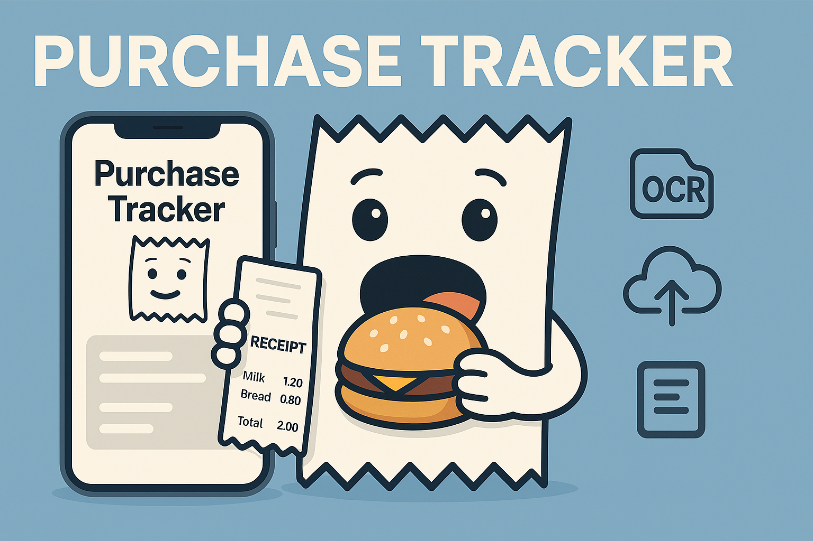

# Building Purchase Tracker: The MVP That Eats Your Receipts (So You Don’t Have To) 🧾🍔

Tired of juggling receipts, apps, and loyalty platforms from every store you visit? Me too. The real headache isn’t just the paper clutter — it’s trying to keep track of your purchases when every store has its own system, its own app, and its own way of showing you what you bought. Comparing your spending across stores? Practically impossible. That’s why I’m building **Purchase Tracker** — a minimal, cross-platform app that lets you snap a photo of any receipt and instantly see all your purchases in one place, no matter where you shop. Aggregation, not aggravation!



## What’s the Big Idea? 💡

**Purchase Tracker** is all about simplicity:

- Snap a paper receipt 📸
- App runs OCR magic to extract the juicy details
- Data is saved to the cloud (no more lost receipts!)
- See your purchase history in a clean, minimalist feed

That’s it. No complicated onboarding, no 17-step setup, just point, shoot, and track. If you can take a selfie, you can use this app (and your receipts will look better, too).

## Why Bother? (a.k.a. The MVP Goal) 🎯

Let’s be honest: most people don’t track their spending because it’s a pain. The goal here is to prove that if you make it *ridiculously* easy, people will actually do it. Plus, I want to see if modern OCR can handle the wild world of receipts (spoiler: some are weirder than others).

## The Tech Stack: Simple, Not Boring 🛠️

- **React Native** for the mobile app (because I like my code like my coffee: reusable and cross-platform)
- **AWS** for the backend (S3, DynamoDB, Lambda, API Gateway, Cognito, and Textract for OCR)
- Minimalist UI: just a feed of receipts, a scan screen, and a profile (with a logout button, for when you need a break from all that responsible adulting)

## How Does It Work? (The 7-Step Dance)

1. User takes a photo of a receipt
2. App sends it to the cloud
3. Lambda stores the photo in S3
4. Textract does its OCR thing
5. Parser turns the text into structured data (store, date, items, total)
6. Data lands in DynamoDB
7. App fetches and displays your purchases

It’s like a conga line, but for your expenses.

## The Data Model (a.k.a. The Nerdy Bit)

```json
{
  "purchaseId": "uuid",
  "userId": "uuid",
  "date": "2025-08-27T12:34:56Z",
  "storeName": "Carrefour",
  "items": [
    { "name": "Milk", "price": 1.20, "quantity": 1 },
    { "name": "Bread", "price": 0.80, "quantity": 1 }
  ],
  "total": 2.00,
  "rawText": "original OCR text",
  "imageUrl": "s3://bucket/..."
}
```

## What’s Next? 🚀

This is just the beginning! Next up:
- Setting up the AWS infrastructure (wish me luck)
- Building the React Native skeleton
- Making sure the app doesn’t mistake your shopping list for a receipt (unless you want it to)

Stay tuned for more posts as I build this thing out, one receipt at a time. Got ideas, jokes, or horror stories about receipts? Drop them in the comments!

---

**MVP = React Native app + AWS (Textract, S3, DynamoDB, Lambda, API Gateway, Cognito).**

User → photo of receipt → OCR → JSON → display in purchase feed. Easy, right? 😎
